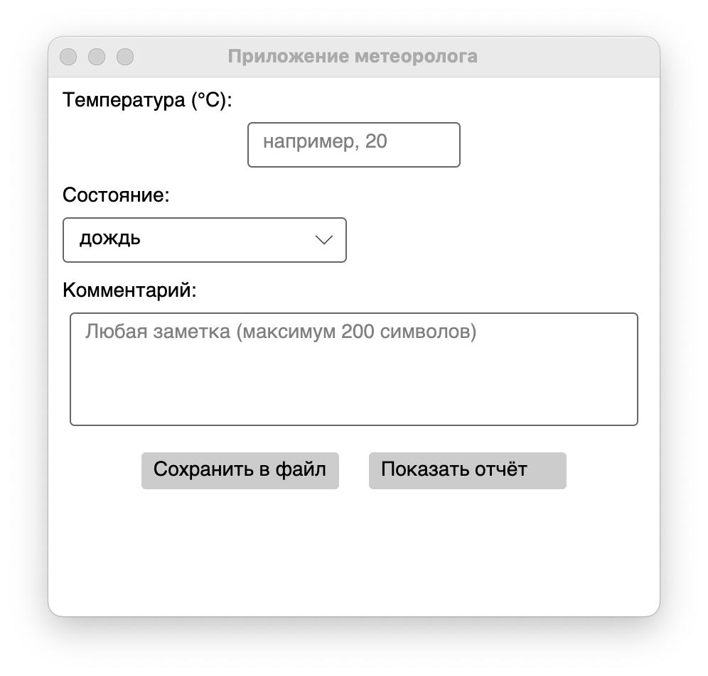

# MeteoReporter

Небольшое десктоп-приложение на Avalonia для ввода данных о погоде и сохранения/показа отчёта.

---

## Описание

MeteoReporterTest — это простое кросс-платформенное приложение на базе Avalonia (.NET 8), в котором пользователь может:
- Ввести температуру (°C), выбрать состояние погоды и добавить комментарий
- Кнопкой **«Показать отчёт»** увидеть сформированный отчёт внизу окна (сразу закрывается через 2 секунды)
- Кнопкой **«Сохранить в файл»** сохранить отчёт в текстовый файл с таймстампом (`weather_YYYYMMDD_HHMMSS.txt`)



---

## Требования

- Установленный [.NET 8 SDK](https://dotnet.microsoft.com/download) (версия 8.0.410 или новее)
- Платформа Avalonia UI (подтянется автоматически при `dotnet restore`)
- Рекомендуется Git для клонирования и сборки из репозитория

---

## Структура репозитория
MeteoReporter/  
├── .gitignore  
├── README.md  
├── MeteoReporter.csproj  
├── App.axaml  
├── App.axaml.cs  
├── MainWindow.axaml  
├── MainWindow.axaml.cs  
├── Program.cs  
└── app.manifest

## Быстрый старт

1. **Клонируйте репозиторий**
   ```bash
   git clone https://github.com/IronBigCat/MeteoReporter
   cd MeteoReporter